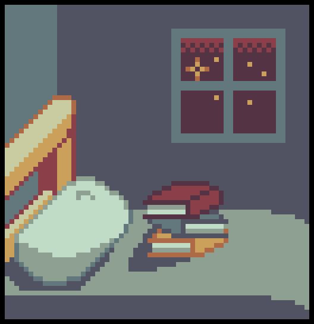

<h1>

 
<a href="https://estudos.princessmortix.link">Estudos do Quarto</a> 
</h1>

 <i> "O seu local de estudos" </i> 

 

Estudos do quarto é um projeto que visa fazer resumos das matérias para os alunos, complementendo a explicação do professor que é dada em aula.

****

## O que é o projeto?

O Estudos no Quarto é um projeto que visa ajudar os alunos com dificuldades nas matérias lecionadas em aulas, e ajudá-los a estudar para as provas.

Os resumos são feitos por alunos, direcionado para os alunos.

## Mas... de graça?

Sim! Sem nenhum custo ou anúncios. 

O site é construído com ajuda de voluntários — que dedicam o seu tempo livre — e também que não recebem financeiramente por isso.

## Como posso ajudar?

Você pode nos ajudar enviando pull requests com novos resumos, corrigindo minha grámatica, ou até mesmo dando sugestões pro site abrindo um issue. Se você não tem nenhuma ideia, você também pode dar uma ⭐ nesse repositório, isso nos ajuda bastante.

## Agradecimentos

- [Jekyll](https://jekyllrb.com), a ferramenta que o site usa;
- [GitHub](https://github.com), o serviço aonde o site está hospedado;
- [abhinavs](https://github.com/abhinavs), pelo tema Moonwalk, que o site utliza;
- [Todo mundo que escreveu os resumos](https://estudos.princessmortix.link/sobre), em especial Júlia, Yngrid, Bia e Nicole <3;
- [roridev](https://github.com/roridev), com correções e sugestões;
- [Font Awesome](https://fontawesome.com), pelos icons;
- Mei & [Nex](https://twitter.com/felipe_nex), pelo o icon do site;
- [MathJax](https://www.mathjax.org), o visualizador de matemática.
